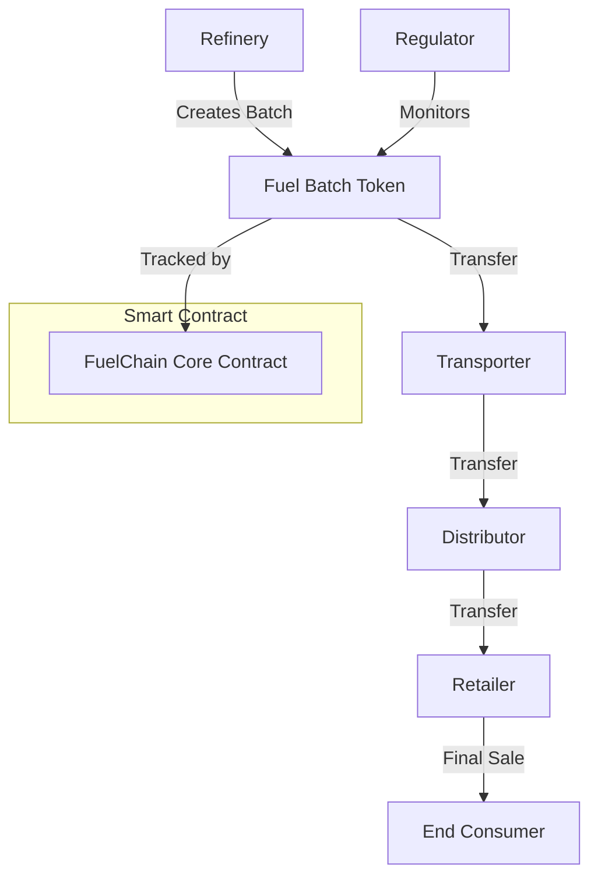

# FuelChain Logistics System

A decentralized platform for tokenizing and managing fuel assets throughout the supply chain, from refineries to end consumers.

## Overview

FuelChain creates digital representations of physical fuel assets to enable:
- Transparent tracking of fuel batches
- Efficient transfer of ownership
- Automated settlement of transactions
- Immutable record-keeping of fuel logistics

The platform connects key stakeholders including refineries, transporters, distributors, retailers, and regulators in a seamless digital ecosystem.

## Architecture



The system is built around the `fuelchain-core.clar` contract which manages:
- Participant registration and roles
- Fuel batch creation and tracking
- Ownership transfers
- Status updates
- Batch specifications
- Transfer history

## Contract Documentation

### FuelChain Core Contract

#### Role Types
- Admin (u1)
- Refinery (u2)
- Transporter (u3)
- Distributor (u4)
- Retailer (u5)
- Regulator (u6)

#### Fuel Types
- Gasoline (u1)
- Diesel (u2)
- Jet Fuel (u3)
- Natural Gas (u4)
- Biofuel (u5)

#### Status Types
- Created (u1)
- In Transit (u2)
- At Distributor (u3)
- At Retailer (u4)
- Sold (u5)

## Getting Started

### Prerequisites
- Clarinet
- Stacks wallet for deployment

### Basic Usage

1. Register participants:
```clarity
(contract-call? .fuelchain-core register-participant 
    'SP2J6ZY48GV1EZ5V2V5RB9MP66SW86PYKKNRV9EJ7 
    u2 
    "Global Refinery Corp" 
    (list u1 u2))
```

2. Create fuel batch:
```clarity
(contract-call? .fuelchain-core create-fuel-batch 
    u1                  ;; fuel type (gasoline)
    u1000              ;; volume
    u8                 ;; quality rating
    u93                ;; octane rating
    u10                ;; sulfur content
    "Premium Grade")   ;; additives
```

3. Transfer batch:
```clarity
(contract-call? .fuelchain-core transfer-batch 
    u1                  ;; batch-id
    'SP2J6ZY48GV1EZ5V2V5RB9MP66SW86PYKKNRV9EJ7 
    u2                  ;; new status
    u50000             ;; price
    "Regular delivery")
```

## Function Reference

### Administrative Functions
- `register-participant`: Register new supply chain participant
- `update-participant`: Update participant information
- `set-contract-admin`: Change contract administrator

### Batch Management Functions
- `create-fuel-batch`: Create new fuel batch (refineries only)
- `transfer-batch`: Transfer ownership of fuel batch
- `update-batch-status`: Update batch status without transfer
- `split-batch`: Split batch into two parts

### Read-Only Functions
- `get-participant`: Get participant information
- `get-fuel-batch`: Get batch information
- `get-batch-specifications`: Get detailed batch specs
- `get-transfer`: Get transfer history record
- `can-handle-fuel-type`: Check fuel type authorization
- `is-batch-owner`: Verify batch ownership

## Development

### Testing
1. Set up local environment:
```bash
clarinet new
```

2. Run tests:
```bash
clarinet test
```

### Local Development
1. Start REPL:
```bash
clarinet console
```

2. Deploy contract:
```bash
clarinet deploy
```

## Security Considerations

### Access Control
- Only authorized participants can create and transfer batches
- Role-based permissions enforce supply chain hierarchy
- Fuel type restrictions prevent unauthorized handling

### Data Validation
- Volume and quality ratings are strictly validated
- Status transitions are controlled
- Ownership verification before transfers

### Limitations
- No direct integration with physical tracking systems
- Requires trusted participants for data input
- Cannot prevent off-chain transactions

### Best Practices
- Verify participant credentials before registration
- Maintain accurate volume tracking
- Regular auditing of transfer history
- Implement additional verification for high-value transfers